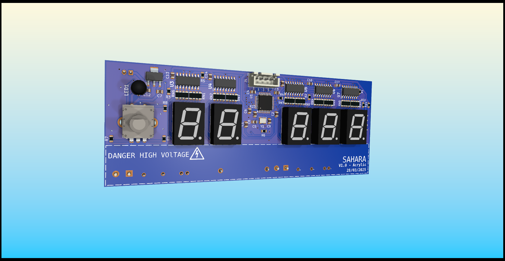
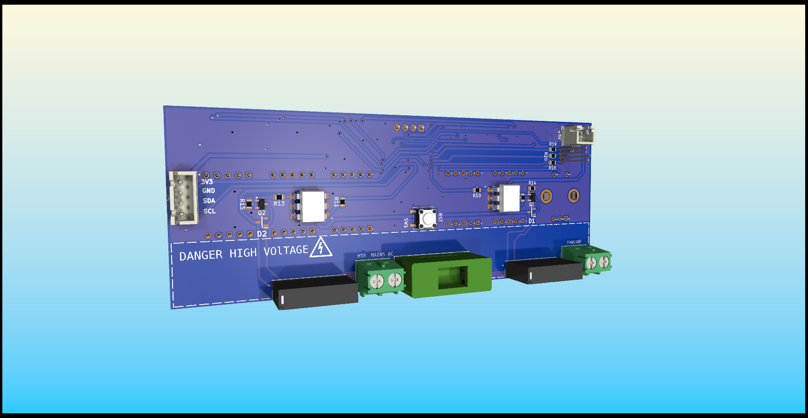

# Sahara - diy 3d printer filament dryer

This is the hardware and software I designed to convert a cheap food dehydrator into a more intelligent and precisely controlled device, with the aim of drying 3d printer filament.

The original product used was a Esperanza Food Dehydrator EKD003.

You set a target temperature, how long you want to dry and then it does the rest.

It is controlled by a STM32, that via relays turn on and off the fan unit and heating unit.

Be aware that this runs on **mains voltage**, so take the necessary precautions. I've implemented as much safety as I deem reasonable, but use at your own risk. I the main board with a external prefabricated 230VAC to 5VDC board and I connect an external RC snubber unit in parallel with the fan.

